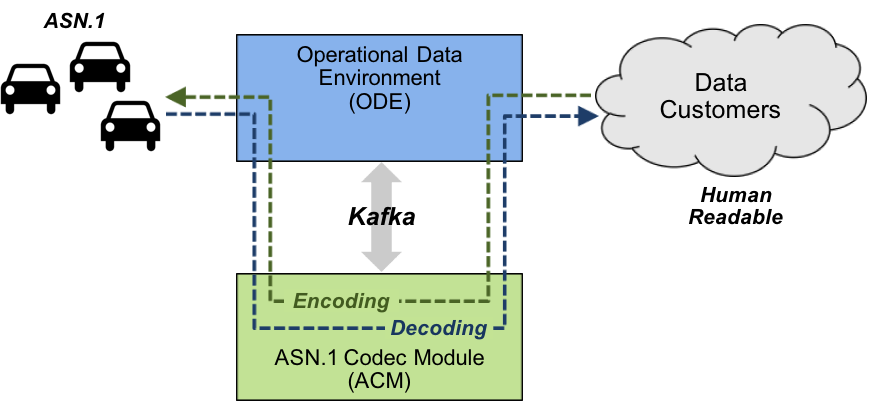

# Abstract Syntax Notation One (ASN.1) Codec Module for the Operational Data Environment (ODE)

The ASN.1 Codec Module (ACM) processes Kafka data streams that preset [ODE
Metadata](http://github.com/usdot-jpo-ode/jpo-ode/blob/develop/docs/Metadata_v3.md) wrapped ASN.1 data.  It can perform
one of two functions depending on how it is started:

1. **Decode**: This function is used to process messages *from* the connected
vehicle environment *to* ODE subscribers. Specifically, the ACM extacts binary
data from consumed messages (ODE Metatdata Messages) and decodes the binary
ASN.1 data into a structure that is subsequently encoded into an alternative
format more suitable for ODE subscribers (currently XML using XER).

1. **Encode**: This function is used to process messages *from* the ODE *to*
the connected vehicle environment. Specifically, the ACM extracts
human-readable data from ODE Metadata and decodes it into a structure that
is subsequently *encoded into ASN.1 binary data*.



## Current ACM Data Types

- The ACM handles inbound (from CV environment to ODE) Basic Safety Messages (BSMs)
and Traveler Information Messages (TIMs) as SAE J2735 MessageFrames. It will also
handle the MessageFrames if wrapped in a IEEE 1609.2 Data frame.

	 - IEEE 1609.2 frames are usually encoded using COER rules, but the
       module will use metadata provided by the ODE to determine the decoder to use.

	 - SAE J2735 frames are usually encoded using UPER rules, but the
	   module will use metadata provided by the ODE to determine the decoder to use.
     
- The ACM handles outbound (from ODE to CV environment) TIMs as SAE J2735 MessageFrames.

	 - Currently, the SAE J2735 MessageFrame is encoded by the ODE using XER
       rules. UPER rules are used to encode these payload for transmission to the CV environment.

## Table of Contents

1. [Release Notes](#release-notes)
1. [Project Management](#project-management)
1. [Code Management and Deployment](#code-management-and-deployment)
1. [Downloading the Source Code and Documentation](#downloading-the-source-code-and-documentation)
1. [Documentation](#documentation)
1. [Code Documentation](#code-documentation)
1. [Installation](docs/installation.md)
1. [Configuration and Operation](docs/configuration.md)
1. [Development](docs/coding-standards.md)

## Release Notes

### ODE Sprint 24

- ODE-537/581/584/585/586/537: ASN.1 codec module development and integration. 

# Development and Collaboration Tools

## Project Management

This project is managed using the Jira tool.

- [Jira Project Portal](https://usdotjpoode.atlassian.net/secure/Dashboard.jsp)

## Code Management and Deployment

Detailed [installation instructions](docs/installation.md) are provided on another page, so we recommend starting there
if you want to run the ACM. If you just want to examine the code and documentation, you will need Git.

- [Git](https://git-scm.com/)

# Getting Started

## Downloading the Source Code and Documentation

Follow these instructions to download the source code and documentation onto your machine. *This will not download the
submodules the ACM requires to build (see the [installation instructions](docs/installation.md)).*

```bash
git clone https://github.com/usdot-jpo-ode/asn1_codec.git
```
or

```bash
git clone git@github.com:usdot-jpo-ode/asn1_codec.git
```

## Documentation

This documentation is in the `README.md` file. The remaining documentation files are in the `docs` subdirectory.  The
following document will help practitioners build, test, deploy, and understand the ACM's functions:

- [ASN.1 Codec Module User Guide](docs/acm_user_manual.docx)

All stakeholders are invited to provide input to these documents. Stakeholders should direct all input on this document
to the JPO Product Owner at DOT, FHWA, or JPO. To provide feedback, we recommend that you create an "issue" in this
repository (https://github.com/usdot-jpo-ode/asn1_codec/issues). You will need a GitHub account to create an issue. If you
don’t have an account, a dialog will be presented to you to create one at no cost.

## Code Documentation

Code documentation can be generated using [Doxygen](https://www.doxygen.org) by following the commands below:

```bash
$ sudo apt install doxygen
$ cd <install root>/asn1_codec
$ doxygen
```

The documentation is in HTML and is written to the `<install root>/asn1_codec/docs/html` directory. Open `index.html` in a
browser.  
